Creating a Network Graph with Gephi
===================================

Gephi is a powerful tool for network analysis, but it can be
intimidating. It has a lot of tools for statistical analysis of network
data — most of which you won't be using at this stage of your work.

Open Gephi
----------

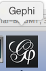

Be sure you're on the Windows side of your computer and that you're
opening Gephi version 8.2. (Gephi 8.2 for Mac doesn't work; if you want
to use Gephi at home and you have a Mac, be sure and download 8.1.)

Create a new project
--------------------

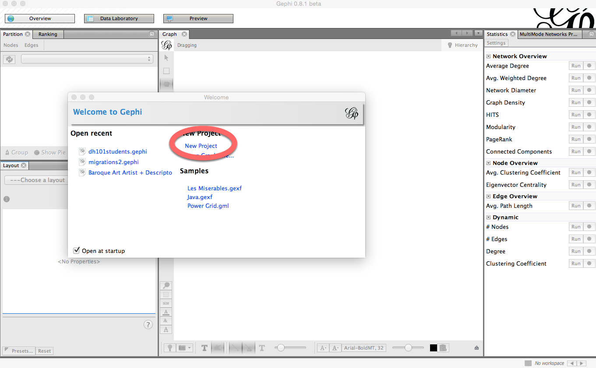

Click on **New Project** on the "Welcome to Gephi" popup window.

Do not freak out.
-----------------

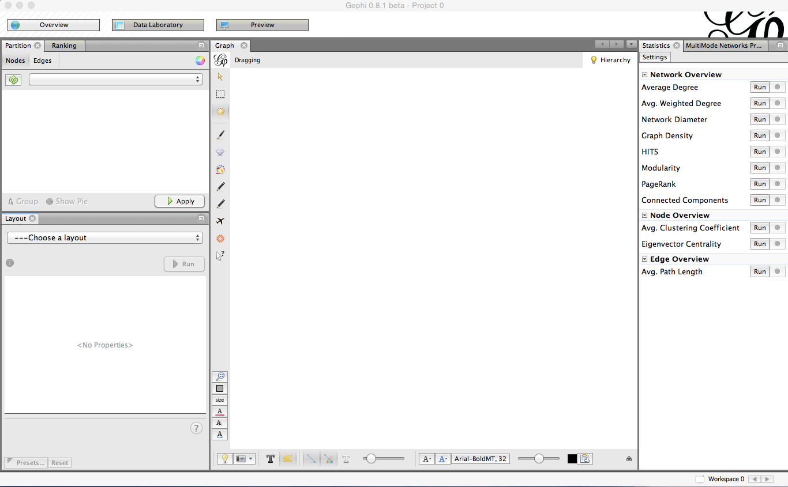

The Gephi workspace looks really confusing and intimidating. Do not
freak out.

Click on "Data Laboratory."
---------------------------

This is where you'll upload your data.

In the Data Laboratory, click on "Import Spreadsheet."
------------------------------------------------------

Click on **Import Spreadsheet** in order to upload your data.

Import "DH101 6B Dataset 2 node list" as a Node table
-----------------------------------------------------

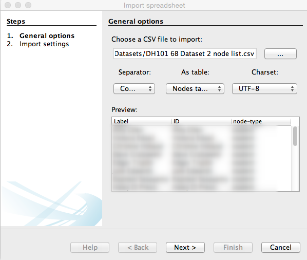

**1)** Click on the button with the three dots on it to select a file
and click on **DH101 6B Dataset 2 node list.**

**2)** Be sure you choose **Nodes table** from the box that allows you
to choose between an edge table and a node table.

**3)** Finally, click **Next** to move on to the next screen and
**Finish** on the window that follows.

Import "DH101 6B Dataset 2 edge list" as an Edges table
-------------------------------------------------------

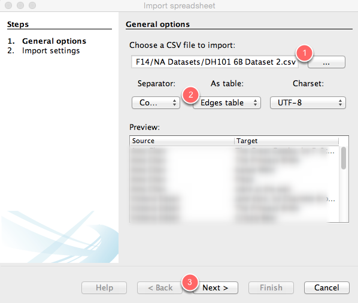

**1)** Click on the button with the three dots on it to select a file
and click on **DH101 6B Dataset 2.**

**2)** Be sure you choose **Edges table** from the box that allows you
to choose between an edge table and a node table.

**3)** Finally, click **Next** to move on to the next screen and then
**Finish** on the following screen.

What is this, it's confusing and I hate it.
-------------------------------------------

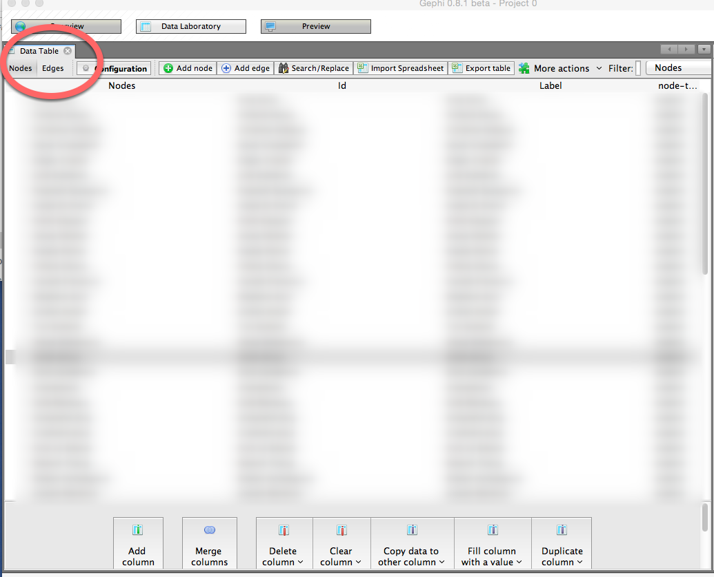

This is where you can manipulate the data you've uploaded. If you click
on the **Nodes** or **Edges** tab, you can toggle between spreadsheets.
For the time being, however, we're not going to change anything.

Click on "Overview."
--------------------

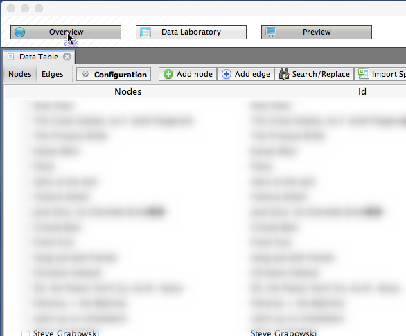

OK, we can finally start visualizing. Click on **Overview** to go to the
pane that will show your network graph.

Cool, I guess?
--------------

You now have a network diagram! You can't really see much, though.

Manipulate your diagram so it's more legible. 
----------------------------------------------

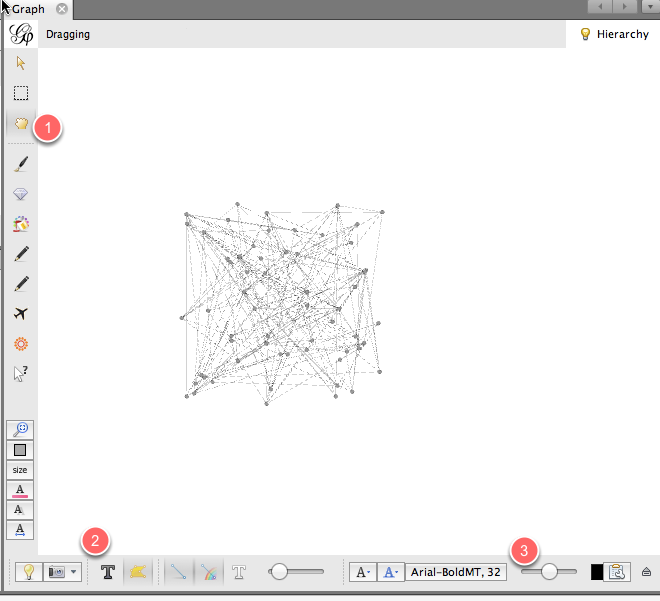

Use the scroll wheel to zoom in and out. **1)** Use the hand icon to
move the diagram around. **2)** Turn labels on by clicking the **T**.
**3)** Adjust the size of the labels with the scrubber.

What are we looking at?
-----------------------

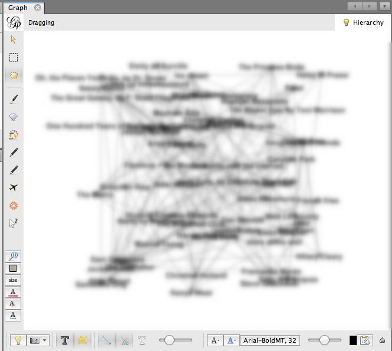

This is a **bimodal** network graph, meaning it contains two different
kinds of things: **students** and **preferences**. Each student is
connected to his or her preferences with an **edge**. It's still a
little hard to see anything, though.

Separate "students" from "preferences."
---------------------------------------

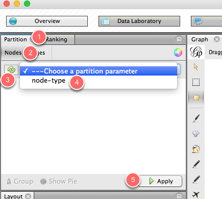

Let's add some color so we can distinguish between students and their
preferences. On the upper left-hand portion of the screen, you'll see a
box that has two tabs: **Partition** and **Ranking**. Be sure that the
**Partition** tab is selected **(1)**. Then, within the **Partition**
tab, be sure that **the Nodes** tab is selected **(2)**. Click the
button with the two green arrows to refresh your selection **(3)**.
Then, from the dropdown menu, select **node-type (4)**. Finally, click
**Apply (5).**

Now you can distinguish students from their preferences.
--------------------------------------------------------

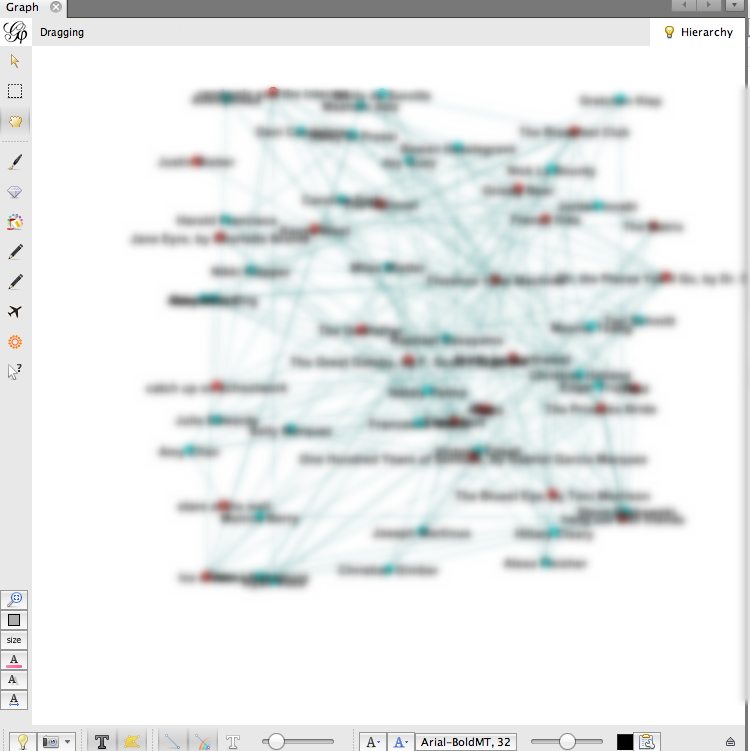

Calculate average degree.
-------------------------

Let's make the more popular nodes bigger, to indicate that more students
have chosen them. To do that, we need to calculate the nodes' **Average
Degree**. To do this, head to the right side of your Gephi window, where
you'll find a **Statistics** page. Click the **Run** button that appears
to the right of **Average Degree**. Then close the **Degree report**
that pops up.

Size nodes according to their popularity.
-----------------------------------------

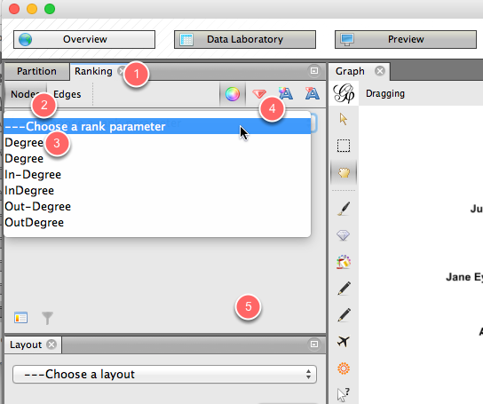

Now let's use the average degree, which we just calculated, to size the
nodes. Head back to the left side of the Gephi window, and this time
click on the **Ranking** tab **(1)**. Within that tab, click on **Nodes
(2)**, and from the drop-down menu, click on **Degree (3)**. Click on
the tiny red diamond to rank nodes by size **(4)**. Then hit **Apply
(5)**.

Now you can see who chose what, and how popular those choices were!
-------------------------------------------------------------------

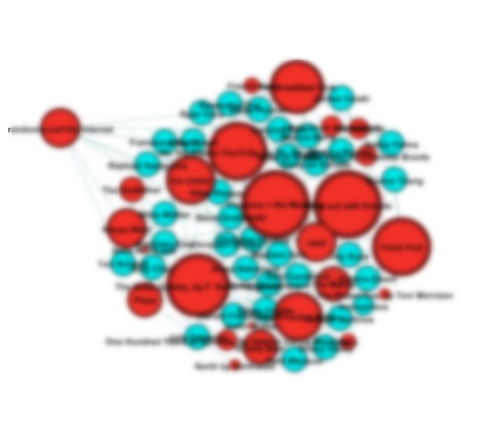

Calculate modularity. 
----------------------

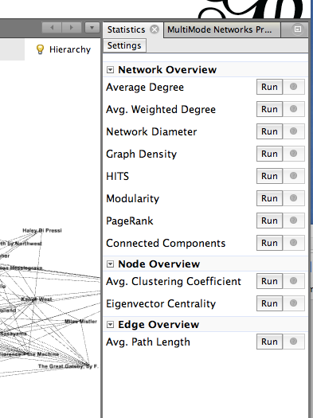

Let's see if we can identify clusters of students who have things in
common. To do this, we'll calculate modularity. On the **Statistics**
pane (at the right of your screen), click on the **Run** button that
appears next to **Modularity**. In the next popup window, click **OK**,
then click **OK** in the next window.

Color your nodes by community.
------------------------------

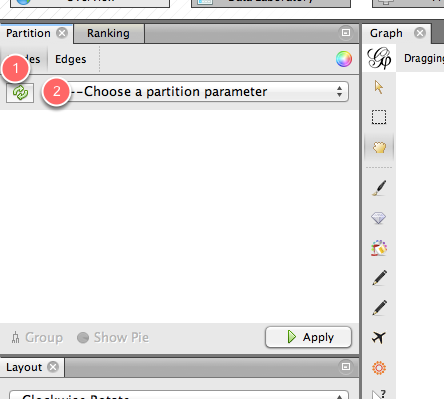

Now that we've calculated modularity, we can color nodes according to
their communities. To do that, go to the **Partition** pane (on the left
side of the Gephi window) and click on the little **Refresh** icon
**(1)**. From the dropdown window, select **Modularity Class**. Finally,
click

Now we have communities.
------------------------

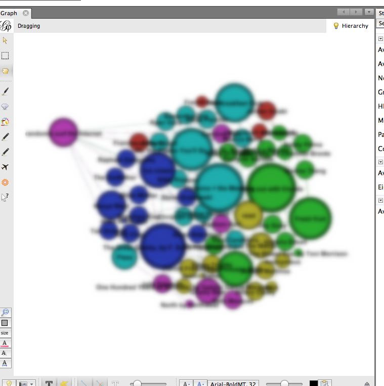

Now we can see which students' preferences bind them together into
communities. Students who have the most in common are colored the same
color, along with their common preferences.

Save and share!
---------------

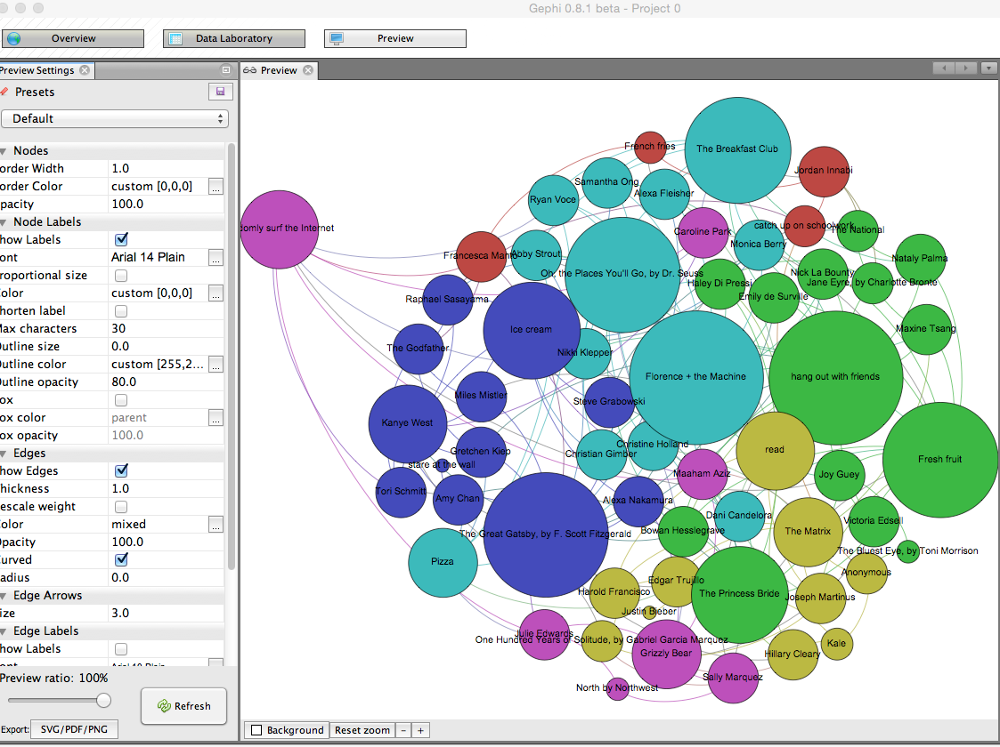

You can save your Gephi graph as a Gephi file, so you can open it up
again later and edit it. You can also take a screenshot from the
**Overview** panel (click on the tiny camera). You can also click on the
**Preview** pane to see a somewhat nicer presentation of your network
diagram, and you can change the look of it on the left-hand side of that
pane. (Be sure to click **Refresh** after each change.) Once you're
happy, click on the **SVG/PDF/PNG** button to export it as an image
file.
