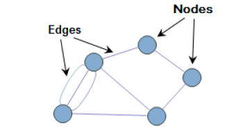
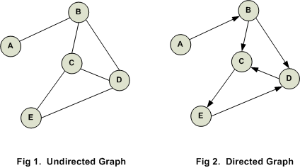
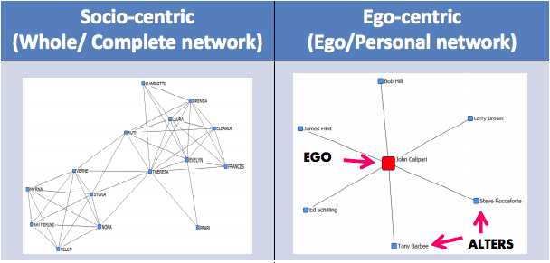
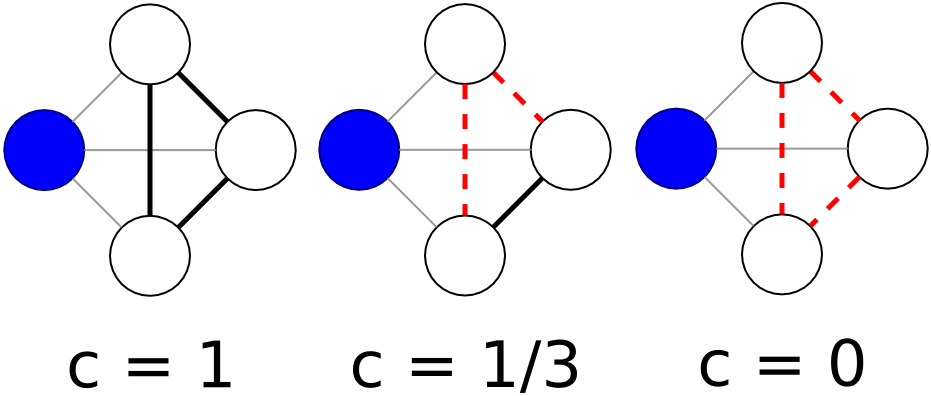

**Social Network Analysis Glossary**

*Adapted from*

Brian V. Carolan, “Key Terms,” *Social Network Analysis and Education:
Theory, Methods & Applications* (SAGE, 2014,
http://www.sagepub.com/carolan/study/materials/KeyTerms.pdf);

Datavu, “Introduction to Network Analysis terminology”
(<http://datavu.blogspot.com/2013/10/sna-social-network-analysis-basic.html>);

Katharina Zweig, “An Introductory Course on Network Analysis”
(<https://sites.google.com/site/networkanalysisacourse/schedule/an-introduction-to-centrality-measures>).

**Basic Terms**

**Social network**

A finite set (or sets) of actors and the relations defined on them. It
consists of three elements: (1) a set of actors; (2) each actor has a
set of individual attributes; and (3) a set of ties that defines at
least one relation among actors.

**Graph**

A common way to visually represent social networks, consisting of two
dimensions: actors and relations (also called nodes and edges).

**Node**

Nodes are the entities in graph (also called vectors). For example, if
we consider Facebook friends as a graph, then every friend is a node. \
\
**Edge**

These are the relationships between nodes. For example, if we consider
Facebook friends as a graph then every friendship is an edge.

*Image via
http://semanticommunity.info/AOL\_Government/Social\_Media\_-\_Six\_Degrees\_of\_Separation\_and\_Now\_Even\_Less*

**Types of Graphs**

**Undirected graph**

When the relationship is always valid in both directions, then it is
called undirected graph. If Dave is friends with Raj on Facebook, then
Raj is also friends with Dave.

**Directed graph**

When the relationship may not be valid in both directions (connecting
nodes), then it is called a directed graph. If Bill is following Steve
on Twitter and Steve is not following Bill, the relationship is
directed.

*Image via
http://www.codediesel.com/wp-content/uploads/2012/02/d-graph1.gif*

**Weighted network**

A network in which the edges between nodes have weights (corresponding
to, e.g., the strength of a relationship) assigned to them.

**Unweighted network**

A network in which the edges between nodes do not have weights assigned
to them.

*Image via
http://blogs.sas.com/content/sascom/files/2011/10/weighted-network2.jpg*

**Single-mode graph**

A type of graph in which all nodes belong to the same category. For
example, in a graph of Facebook friends, each node is a person.

**Multimode graph**

A type of graph in which all nodes are not of same type. For example, a
graph that includes both “buyers” and “sellers” is a multimode (or
two-mode, or bimodal) graph.

**Ego network**

When you perform ego network analysis, you select a focal node (an
“ego”) and determine its connections to other nodes (which are called
“alters”). Each ego is treated as its own case.

*Image via
http://www.analytictech.com/e-net/pdwhandout.pdf*

**Measures of Graphs or Nodes**

**Size**

A measure of the number of actors (nodes) in a complete or egocentric
network.

**Density**

The number of ties in the network reported as a fraction of the total
possible number of ties.

**Reciprocity**

The proportion of mutual ties in a network.

**Distance**

The number of “steps” between any two actors in a network.

**Clustering coefficient**

A measure of a network’s actors’ tendency to “group together” into
pockets of dense connectivity.

*In the first image, the blue node has a
clustering coefficient of one, because all possible connections among
its neighboring nodes have been realized. In the second image, only one
of the possible connections has been realized — so the blue node has a
clustering coefficient of 1/3. In the third image, none of the
neighboring nodes are connected, so the blue node has a clustering
coefficient of 0. Image via Wikipedia.*

**Centrality**

There are multiple ways to determine a node’s importance, or centrality.
The measure you use depends on how you define centrality. Several of
these measures are:

> **Degree centrality **
>
> *An important node is involved in large number of interactions.* The
> number of edges connected with a particular node.
>
> **Eigenvector centrality **
>
> *An important node is connected to important neighbors.* This is a
> measure of influence of a given node in the whole network. The notion
> is how well-connected a given node is with other well connected nodes
> in the network. This is how, for example, Google determines page rank.
>
> **Betweenness centrality**
>
> *An important node lies on a high proportion of paths between other
> nodes in the network.* Model based on communication flow. A person who
> lies on communication paths can control communication flow, and is
> thus important.
>
> **Closeness centrality**
>
> *An important node is typically “close” to, and can communicate
> quickly with, the other* *nodes in the network.* Length of the average
> shortest path between a given node and all other nodes in a graph.
